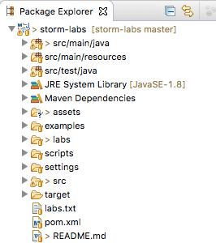
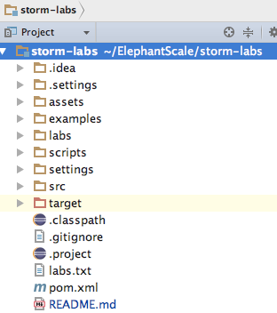

<link rel='stylesheet' href='../assets/css/main.css'/>

[<< back to main index](../README.md) 

Lab 1.1 : Import Storm Project
===========================

### Overview
Import the 'storm-labs' project into your favorite IDE.

### Depends On 
None

### Run time
10 mins

---------------------
STEP 0: To Instructor
---------------------
Walk through this project on screen first.

----------------------------------
STEP 1: Open 'storm-labs' Project
---------------------------------
This is a maven project.  And can be readily opened by Eclipse or IntelliJ.

### Eclipse

* Right click on 'Projects' view
* Select 'Import'
* Select 'Existing Maven Projects'
* Navigate to 'storm-labs' directory and select the directory


### IntelliJ

* File -> Open
* Choose 'storm-labs' directory and select 'pom.xml'  file
* Project will be automatically imported


 
 

<br clear="all"/> 

----------------------------------
STEP 2: Inspect 'ClickstreamGenerator'
---------------------------------
Inspect file : `src/main/java/x/utils/ClickStreamGenerator.java`  
This file generates random clickstream data that we will use.

Right-click on `ClickStreamGenerator.java`  file and run it.

Here is a sample output:

```console


1451635200005,ip_67,user_16,clicked,facebook.com,campaign_5,91,session_251
1451635200010,ip_57,user_89,viewed,foxnews.com,campaign_4,17,session_224
...

{"timestamp":1451635200055,"session":"session_57","domain":"twitter.com","cost":24,"user":"user_31","campaign":"campaign_1","ip":"ip_64","action":"blocked"}
{"timestamp":1451635200060,"session":"session_188","domain":"foxnews.com","cost":26,"user":"user_33","campaign":"campaign_4","ip":"ip_99","action":"clicked"}
```


----------------------------------
STEP 3: Inspect 'ClickstreamTest'
---------------------------------
Inspect Junit test file : `src/test/java/x/util/ClickstreamTest.java`.   
This is a simple Junit test to test clickstream data.  
Right-click on this file and run it as Junit Test.  
Ensure all tests succeed.  Fix any failing test.


## Done
Great.. now your environment is setup!