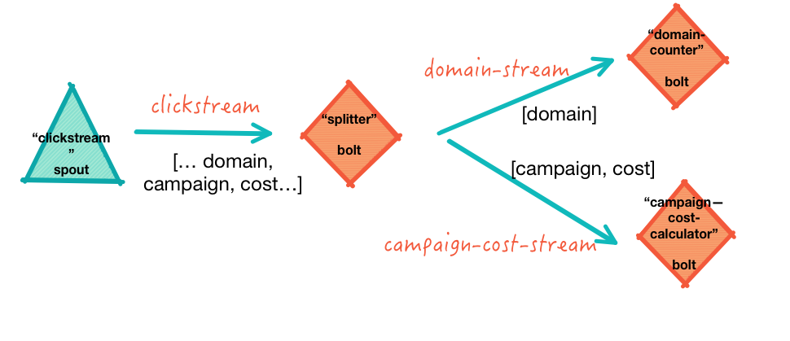

<link rel='stylesheet' href='../assets/css/main.css'/>

[<< back to main index](../README.md) 

Lab 3 : Complex Topology
========================

### Overview
Run a complex Storm topology with multiple streams

### Depends On 
None

### Run time
40 mins

### Project Directory
src/main/java/x/lab_03/


---------
Step 1 :   Understanding Dataflow
---------
 

---------
Step 2 :   Editing Files in 'src/main/java/x/lab_03/'  
---------
You will need to edit these files and fix the TODO items.

* ClickstreamSpout  (nothing to do)
* StreamSplitterBolt
* CostCounterBolt
* DomainCounterBolt
* MultipleStreamTopology

Hints for building topology:

* build out step by step, run it and debug
* start with a spout, run it and make sure it produces output
* then add a bolt, run it and see how data flows

---------
Step 3 :   Run the completed topology and inspect the output
---------
Here is a sample output:

```console

06:39:16.566 [Thread-17-clickstream-executor[3 3]] DEBUG x.lab_03.ClickstreamSpout - sent tuple : [1451635200005,ip_67,user_16,clicked,facebook.com,campaign_5,91,session_251]
06:39:16.569 [Thread-23-splitter-executor[5 5]] DEBUG x.lab_03.StreamSplitterBolt - emited to domain-stream : [facebook.com]
06:39:16.569 [Thread-23-splitter-executor[5 5]] DEBUG x.lab_03.StreamSplitterBolt - emited to campaign-cost-stream : [campaign_5, 91]
06:39:16.571 [Thread-15-campaign-cost-calculator-executor[2 2]] DEBUG x.lab_03.CostCounterBolt - got tuple : source: splitter:5, stream: campaign-cost-stream, id: {}, [campaign_5, 91]
06:39:16.571 [Thread-25-domain-counter-executor[4 4]] DEBUG x.lab_03.DomainCounterBolt - got tuple : source: splitter:5, stream: domain-stream, id: {}, [facebook.com]
06:39:16.572 [Thread-25-domain-counter-executor[4 4]] DEBUG x.lab_03.DomainCounterBolt - 1 entries in the map
06:39:16.572 [Thread-15-campaign-cost-calculator-executor[2 2]] DEBUG x.lab_03.CostCounterBolt - 1 entries in the costs map
06:39:16.572 [Thread-25-domain-counter-executor[4 4]] DEBUG x.lab_03.DomainCounterBolt -    facebook.com = 1
06:39:16.572 [Thread-15-campaign-cost-calculator-executor[2 2]] DEBUG x.lab_03.CostCounterBolt -     campaign_5 = 91

```
