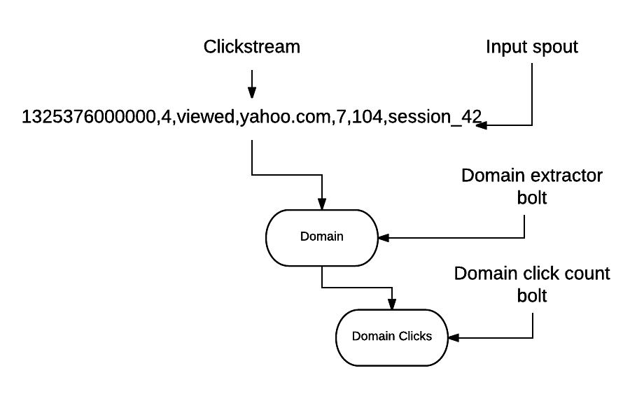
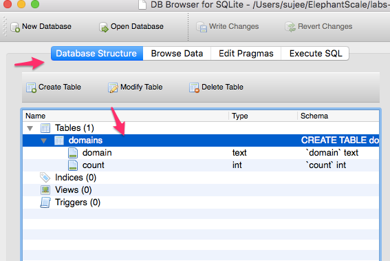
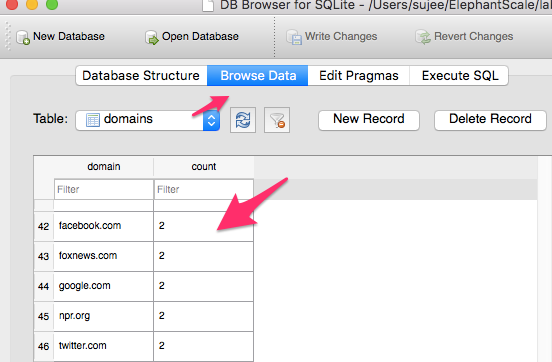

<link rel='stylesheet' href='../assets/css/main.css'/>

[<< back to main index](../README.md) 

Lab 4 : Topology with persistence
========================

### Overview
Add persistence functionality to a bolt

### Depends On 
None

### Run time
40 mins

### Project Directory
src/main/java/x/lab_04/


---------
Step 1 :   Understanding Dataflow
---------
 

---------
Step 2 :   Editing Files in 'src/main/java/x/lab_04/'  
---------
You will need to edit these files and fix the TODO items.

* Understand the design of a persistent bolt
* Walk though the SQL logic 
* Fix all the TODO items


---------
Step 3 :   Run the completed topology and inspect the output
---------
Here is a sample output:

```console


21:43:33.817 [Thread-15-clickstream-executor[2 2]] DEBUG x.lab_04.ClickstreamSpout - sent tuple : [1451635200005,ip_67,user_16,clicked,facebook.com,campaign_5,91,session_251]
1 entries in the map
facebook.com has count of 1
21:43:34.317 [Thread-15-clickstream-executor[2 2]] DEBUG x.lab_04.ClickstreamSpout - sent tuple : [1451635200010,ip_57,user_89,viewed,foxnews.com,campaign_4,17,session_224]
2 entries in the map
facebook.com has count of 1
foxnews.com has count of 1
21:43:34.818 [Thread-15-clickstream-executor[2 2]] DEBUG x.lab_04.ClickstreamSpout - sent tuple : [1451635200015,ip_20,user_53,blocked,facebook.com,campaign_1,73,session_160]
2 entries in the map
facebook.com has count of 2
foxnews.com has count of 1
21:43:35.319 [Thread-15-clickstream-executor[2 2]] DEBUG x.lab_04.ClickstreamSpout - sent tuple : [1451635200020,ip_49,user_29,blocked,cnn.com,campaign_3,31,session_66]
3 entries in the map
cnn.com has count of 1
facebook.com has count of 2
foxnews.com has count of 1

```

---------
Step 4 :   Inspect Sqllite DB
---------
* First download and install [SQL Lite browser](http://sqlitebrowser.org/).
* Launch SQLLite Browser
* Open 'storm.db' from 'storm-labs/storm.db'.  This is the db created by the topology run

 

 

-----
BONUS LAB : Fix DB Schema
----
Currently we are just inserting each new record.  So you'd see duplicate entries for domain.  We want the 'domain' to be unique & primary key.

* First fix the schema in DB.  Locate the code that creates the table and update it
* Then fix the 'saveToDB' to update the insert statement
