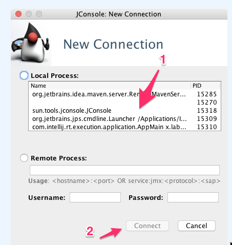
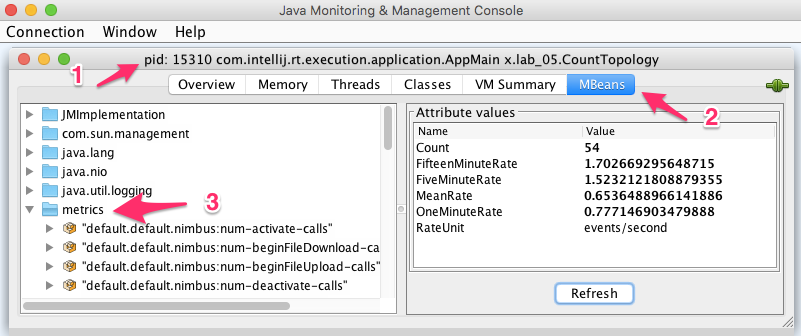
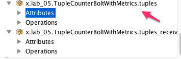

<link rel='stylesheet' href='../assets/css/main.css'/>

[<< back to main index](../README.md) 

Lab 5 : Metrics
===============

### Overview
Instrument Storm code with metrics

### Depends On 
None

### Run time
40 mins


---------
Step 1 :   Inspect 'src/main/java/x/lab_05/'
---------
This directory has 3 files:
* ClickstreamSpout.java
* TupleCounterBoltWithMetrics.java
* CountTopology.java
 
---------------------------
Step 2 :   Bolt : 'src/main/java/x/lab_05/TupleCounterBoltWithMetrics.java'
---------------------------
Edit the above file and fix the TODO items.  
Here are some hints:

**TODO-1 : declare transient fields**
```java
 // metrics - must be transient
  private transient Counter tuplesCounter;
  private transient Meter tuplesMeter;
```

**TODO-2 : initialize metrics**
```java

tuplesCounter = MetricsUtil.metrics.counter(
        MetricRegistry.name(TupleCounterBoltWithMetrics.class, "tuples_received"));
    tuplesMeter = MetricsUtil.metrics.meter(
        MetricRegistry.name(TupleCounterBoltWithMetrics.class, "tuples"));
```


**TODO-3 : update metrics**
```java
    tuplesCounter.inc();
    tuplesMeter.mark();

```

---------
Step 3 :   Run the Topology
---------
**=> Run the topology and make sure it works**


---------
Step 4 :   Inspect The Metrics
---------
In real use case, the metrics would be sent to a sophisticated metrics collector like graphite.

For our purposes, we are going to use JMX client `jconsole` to inspect the metrics.   `jconsole` is part of JDK and you can start it by invoking the program in command line or double-clicking on the jconsole executable.

```
    $  jconsole
```

Also try `visualvm`  (also shipped with JDK).  

 
 
 
