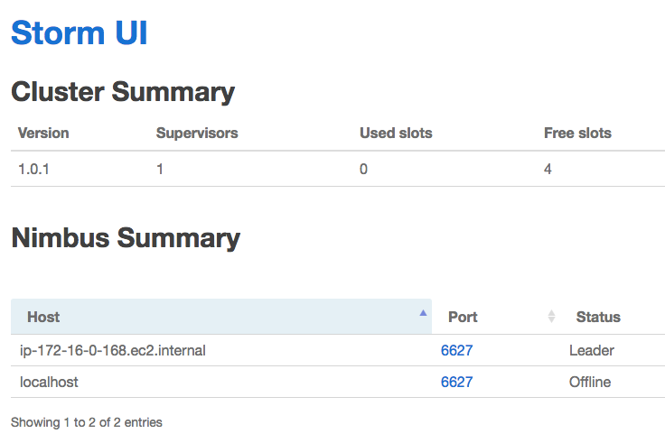
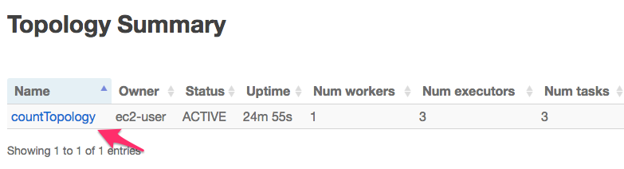
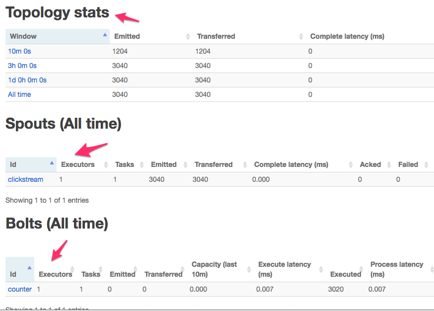

<link rel='stylesheet' href='../assets/css/main.css'/>

[<< back to main index](../README.md) 

Lab 6 : Running Storm As A Cluster
===============

### Overview
Install and use a single node Storm cluster.

### Depends On 
None

### Run time
60 mins


---------
Installation Overview
---------
Here are the overall steps to get 
* Zookeeper
    - install
    - configure
    - start ZK
* Storm
    - install
    - configure
* Start Storm daemons
    - Nimbus
    - Supervisor
    - UI
* Check Storm UI

---------
Step 1 :   Login to your node
---------
Instructor will provide details.

Update Storm labs
```
    $   cd ~/storm-labs
    $   git  pull
    $   cd
```


---------
Step 2 :   Zookeeper
---------

#### 2.1 Unpack Zookeeper binary:

```
    $   cd
    $   tar xvf files/zookeeper-3.4.8.tar.gz
    $   mv   zookeeper-3.4.8   zookeeper

```

#### 2.2  Configure Zookeeper for a single node system.  
We have a sample config file in `~/storm-labs/settings/zoo.cfg`.  Copy this into ZK/conf directory.

```
    $    cp   ~/storm-labs/settings/zoo.cfg   zookeeper/conf/
```

#### 2.3  Start Zookeeper

```
    $   ~/zookeeper/bin/zkServer.sh  start

```

You should see an output like follows:

```console
ZooKeeper JMX enabled by default
Using config: /home/ec2-user/zookeeper/bin/../conf/zoo.cfg
Starting zookeeper ... STARTED
```

#### Verify ZK is running 
Try `jps`  command
```
    $ jps
```

You should see a process called 'QuorumPeerMain'.

Now ZK is running.

---------
Step 3 :   Storm
---------

#### 2.1  Unpack Storm binary
```
    $   cd
    $   tar xvf  files/apache-storm-1.0.1.tar.gz
    $   mv  apache-storm-1.0.1    storm
```


#### 2.2 Configure Storm
We have a sample config file in `~/storm-labs/settings/storm.yaml`.  

Inspect this file:
```
    $   cat  ~/storm-labs/settings/storm.yaml
```

Output may look like following.
```console

## storm.yaml for single node deployment

storm.zookeeper.servers:
     - "localhost"

nimbus.seeds: ["localhost"]
```

Copy this file into Storm/conf directory

```
    $   cp ~/storm-labs/settings/storm.yaml  ~/storm/conf/
```


#### 2.3  Start Nimbus
Try the following command.  (The & at the end starts it in the background)

```
    $   ~/storm/bin/storm   nimbus  &

```

Verify Nimbus successfully started by doing `jps`  command

```
    $  jps
```

Sample output may look like this (your numbers would be different).  Here we see Nimbus and ZK running !

```console
24516 nimbus
24316 QuorumPeerMain
24653 Jps
```

#### 2.4 : Start Supervisor
```
    $   ~/storm/bin/storm supervisor  &
```

Use `jps` command to verify
```
    $   jps
```

#### 2.5 : Start Storm UI
```
    $   ~/storm/bin/storm ui &
```

Use `jps` command to verify
```
    $   jps
```

A sample output, here we have all Storm components (Nimbus, Supervisor, UI) running along with Zookeeper.

```console
25088 Jps
24994 core
24516 nimbus
24859 supervisor
24316 QuorumPeerMain
```


---------
Step 3 :   Explore Storm UI
---------
In a browser go to   `your_machine_ip_address:8080`  (port 8080).

Click around and explore the UI.

Here is a sample screenshot:
 


---------
Step 4 :   Run A Sample Topology
---------

We can run one of our labs in our shiny new Storm cluster.  
First let's compile our labs.

```
    $   cd  ~/storm-labs
    $   git pull

    $   mvn  clean  package  -DskipTests
```

This will create a jar file under 'target' directory.  
Inspect the 'target' directory as follows.
```
    $   l   target
```

Submit our 'countTopology' as follows
```
    $   ~/storm/bin/storm jar   target/storm-labs-1.0.jar     x.remote.CountTopology
```

And checkout the UI !  
Here is a sample screen shot.

 

 


---------
Step 5 :   Bonus Lab
---------
Submit other topologies we have worked on.  Here is a basic work flow
* Edit the file (see section below)
* compile
```
    $   mvn clean package -DskipTests
```
* submit
```
   $   ~/storm/bin/storm jar   target/storm-labs-1.0.jar  TopologyClass
```

## Tips For Editing Files In VM

Edit the file  `src/main/java/x/lab_01/CountTopology.java` and make the following changes (around line number 30)

To edit the file you can use any of the following:

##### Option 1 : UI (nice & easy!)
```
    $   cd ~/storm-labs
    $   noide &

    # now in your browser go to 'your_ip_address:3000'  (port 3000)
    # you will see a nice UI editor
```

##### option 2 : VI or Nano  (old school !)
```
    $   vi   file to edit
    or 
    $   nano  file to edit
```
